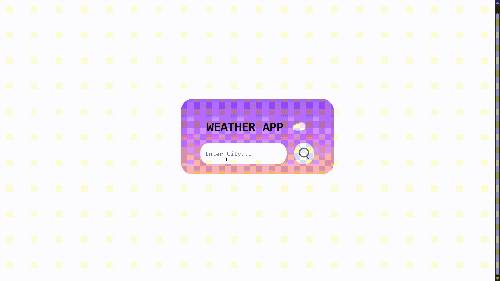

<h1>🌤️ Weather App</h1>

     

A simple, elegant weather app that provides real-time weather updates using React and the OpenWeatherMap API.

<h2>✨ Features</h2>

* 🔎 City Search: Get real-time weather info by entering any city name.
* 🌡️ Weather Details: Temperature, weather description, humidity, and wind speed.
* 📸 Dynamic Icons: Weather icons fetched dynamically based on weather conditions.
* ⚡ Responsive Design: Mobile-friendly layout.
* 📡 Error Handling: Handles invalid city names or API errors gracefully.

<h2>🚀 Getting Started </h2>

<h3>1. Clone the repository</h3>

git clone https://github.com/your-username/weather-app.git  
cd weather-app

<h3>2. Install dependencies</h3>

npm install

<h3>3. Set up Environment Variables</h3>

Create a .env file at the root of your project and add your OpenWeatherMap API key: 

VITE_WEATHER_API_KEY=your_openweathermap_api_key_here 

⚠️ Make sure you sign up at OpenWeatherMap to get your free API key.

<h3>4. Run the development server</h3>

npm run dev

<h2>🎥 Demo<h2>

  

<h2>🙌 Acknowledgements</h2>

* React.js
* Axios
* OpenWeatherMap API
